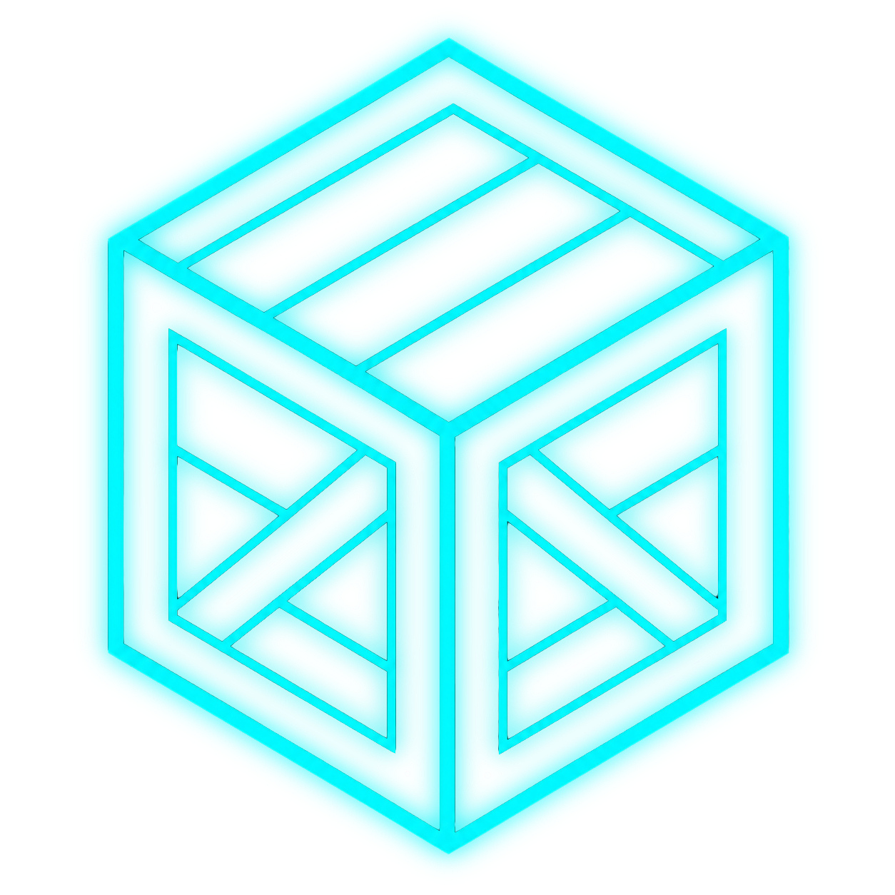

<div align="center">



# The `.crate` format

**An open, verifiable archive format for audio sessions — readable forever, with or without Crate.**

*Your masters outlive apps, companies and file systems. So does this format.*

</div>

---

A `.crate` package is a **7-Zip archive** of **standard FLAC/WavPack streams** plus a
**plain-JSON manifest** that documents byte-exact reconstruction. No proprietary bytes anywhere
in the container. This repository is the format's *no-lock-in guarantee*, in three parts:

| | |
|---|---|
| **[FORMAT.md](FORMAT.md)** | the complete decode specification — every rule needed to rebuild every file byte-for-byte |
| **`recovery_reference.py`** | a normative reference decoder: one dependency-free Python file + the standard `flac`/`wvunpack` CLIs |
| **`vectors/` + `verify.sh`** | real packages packed by the real engine, and a one-command proof that they rebuild byte-exactly **without Crate** |

## Prove it yourself — one command

```sh
sh verify.sh
```

That script unpacks every shipped vector with standard tools (`cat`, `age`, 7-Zip, FLAC,
WavPack), runs the reference decoder, compares every rebuilt byte against the shipped source
trees, and asserts the interesting mechanism actually fired in each vector. It passes with **no
Crate software installed**. The vectors cover: plain hybrid packs, the sub-file dedup chunk
store, cross-stem residual + inter-channel (panned-mono) coding, WavPack float/>8-channel
streams, OS-junk stripping + symlinks + whole-file dedup, and an encrypted package split into
resumable volumes with PAR2 recovery sidecars.

To check the download itself first: `cd vectors && shasum -a 256 -c SHA256SUMS`.

The encrypted vector's passphrase is published **by design** — a test vector must
include everything needed to decrypt it; no real customer's passphrase is or can be in this
repository.

Every vector's source tree ships beside its package, and `tools/make_vectors.py` regenerates
all of them deterministically — the vectors are reproducible, not samples.

## The guarantees

- **Unpacking is free, forever, in every sense** — no payment, no account, and not tied to our
  app: the format spec plus standard tools are sufficient, by construction and by proof.
- **Every file is verified, not hoped for.** Each file's SHA-256 is recorded at pack time and
  re-checked at rebuild time; a mismatch is quarantined as `<name>.UNVERIFIED`, never delivered
  at its real path. One bad file never aborts the rest.
- **Backward compatible, always.** Major-version bumps are the only breaking mechanism, old
  packs decode forever, and any pack-side feature that isn't taught to this spec doesn't ship.
  That rule is enforced in Crate's release gates, not promised in a blog post.
- **No lock-in is structural, not a promise.** The container is 7-Zip; the audio is FLAC and
  WavPack — the same codecs archives and studios already trust; the manifest is plain JSON;
  encryption is [age](https://age-encryption.org); recovery data is PAR2.

## The lineage

Every format you already trust was built by a team this size or smaller. ZIP — Phil Katz,
essentially alone. tar and gzip — no company at all. 7-Zip — Igor Pavlov, one person.
FLAC — Josh Coalson, then the Xiph.Org nonprofit. WavPack — David Bryant, to this day.
None had corporate scale until the ecosystem adopted them, not the reverse. The `.crate`
format is stewarded in that tradition: small, published, and yours to verify.

## The longevity promise

[PROMISE.md](PROMISE.md) (longevity, including a six-month hosted-data retrieval window) and [PATENTS.md](PATENTS.md) (the patent promise) are our standing commitments: what happens to these files if Fluxcode
Studio ever dissolves or abandons the format — written down, dated, and acquisition-safe.

## For engineers

- **Decode flow:** `7z x -spd` the container (after `cat` for split volumes, `age -d` for
  encrypted) → walk `manifest.files[]` per [FORMAT.md §1](FORMAT.md) → verify every
  `sha256_original`.
- **Trust model:** everything in the manifest is untrusted input; the reference decoder
  fail-closes on hostile paths and structural nonsense (§2).
- **The wvunpack `-o` trap** (§1) is the one thing most likely to silently break a
  reimplementation — read it before writing a decoder.

## Integrating `.crate` into your app

**Credit, if you ship support:** MIT already requires keeping the copyright notice in your
distribution — and we ask something friendlier in return: if your app reads or writes `.crate`,
tell us at the address below and we'll list you as a conformant adopter here.

**Lane 1 — self-serve, today, no permission needed.** Reading and writing `.crate` packages is
licensed for everyone under [MIT](LICENSE): implement the [minimal writer profile](FORMAT.md)
(store non-audio verbatim, FLAC the audio, emit the v4 manifest) and the [reference
decoder](recovery_reference.py) as your reader, and your app exports and opens real `.crate`
files. The spec and the vectors are your conformance suite — if `verify.sh` logic accepts your
packs, you're valid.

**Lane 2 — the full compression engine, licensed.** The dedup + residual transforms that reach
the measured sizes are the product, not the format. If you want them embedded in your
application, write to:

> **[licensing@fluxcode.studio](mailto:licensing@fluxcode.studio?subject=%5BCrate%5D%20Integration%20inquiry)**

A real person reads it, and we answer within a week — with a straightforward license, not a
procurement process. That is the whole company between you and the engine.

## Links

- Governance: [GOVERNANCE.md](GOVERNANCE.md) · Security: [SECURITY.md](SECURITY.md) · Conformant adopters: [ADOPTERS.md](ADOPTERS.md)
- Crate — the app: <https://crate.fluxcode.studio>
- Format docs in the app: <https://crate.fluxcode.studio/docs#verification>

## License

[MIT](LICENSE) © Fluxcode Studio LLC. The reference decoder is additionally dedicated to the
public domain, to the extent that dedication is valid where you are.

Crate™ and the crate logo are trademarks of Fluxcode Studio LLC. Conformant implementations
may truthfully state that they read or write the `.crate` session format.
